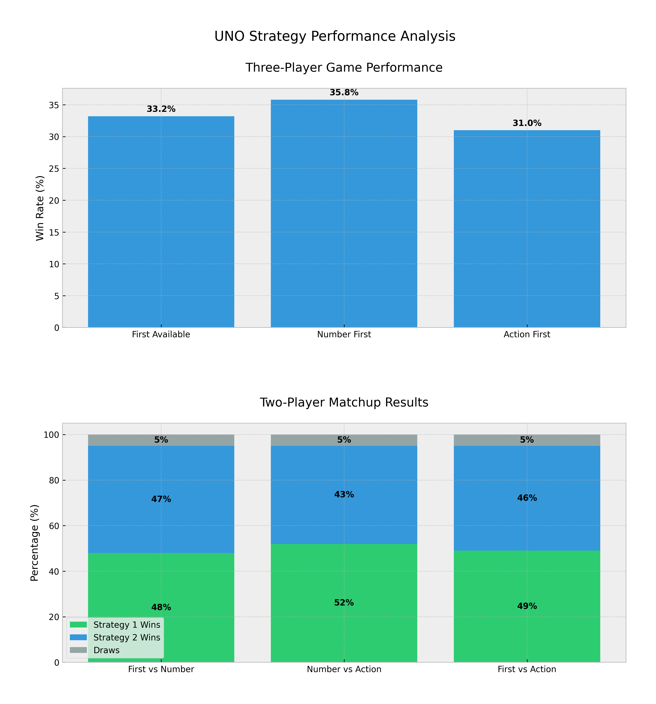

# 2024F CS2910 Project Report
**Group Members**
1. Mohamed Elsabah (373007)
2. Adham Tawfiq (Student Number)

# Summary of Game
UNO is a popular card game where players aim to be the first to empty their hand of cards. The game uses a specialized deck of cards with numbers (0-9) and action cards (Skip, Reverse, Draw Two, Wild, Wild Draw Four) in four colors (Red, Blue, Green, Yellow). Players must match the color, number/action of the previously played card. Action cards provide strategic elements by affecting turn order or forcing card draws. The game combines luck with tactical decision-making in card play timing.

## Game Rule Modifications
Our implementation of UNO incorporates several strategic modifications to the official rules to enhance gameplay dynamics and create more interesting strategic scenarios:

1. Draw Card Stacking
    - Unlike official rules, we allow players to stack draw cards (+2 and +4)
    - When a player plays a draw card, the next player can either:
        * Draw the required cards
        * Play another draw card to add to the stack
    - This creates intense chain reactions and more profound strategic decisions

2. Game-Ending Conditions
    - We've implemented two unique game-ending scenarios:
        * Traditional: A player uses all their cards
        * Draw Condition: The deck is depleted with no winner
    - This prevents infinite games and adds strategic depth to deck management

3. Turn Structure
    - Modified the turn structure to accommodate stacking mechanics
    - Players must immediately decide whether to stack or accept card draws
    - This creates more dynamic and engaging gameplay

These modifications were carefully chosen to:
- Increase strategic depth
- Create more engaging player interactions
- Prevent game stalemates
- Balance aggressive and defensive play styles

## Experiment Report
## Player Strategies
1. First Available Card Strategy: A straightforward approach that plays the first valid card in the player's hand. This strategy represents a baseline player who makes no strategic card order or timing decisions. It simulates a novice player focusing solely on making legal moves without considering long-term advantages.

2. Number Card First Strategy: A systematic strategy prioritizes playing number cards first and saving action cards last. This approach aims to deplete the number of cards from the hand before using any action cards, regardless of the game situation. It represents a systematic player who follows a strict order of play: numbers first, then actions.

3. Action Card First Strategy: An aggressive strategy that aims to disrupt opponents by using action cards early in the game. This approach immediately impacts other players' turns and hands, potentially preventing them from playing their planned moves. It represents an offensive player who prioritizes controlling game flow over card conservation.

## Procedure
Our experiment was designed to comprehensively evaluate each strategy's effectiveness in two-player and three-player game scenarios. The simulation was structured as follows:

- Three-Player Games: We ran 30,000 trials where each player used a different strategy, allowing us to assess how strategies perform in a more complex, multi-player environment.
- Two-Player Matchups: To analyze head-to-head performance, we conducted 10,000 trials for each possible strategy pairing (Strategy 1 vs. 2, 2 vs 3, and 1 vs 3).

For each game:
- Players were dealt seven cards initially
- Games continued until either a player won by emptying their hand or the deck was depleted
- A turn limit of 1000 was implemented to prevent infinite games
- We tracked:
    - Wins per strategy
    - Game duration
    - Number of draws
    - Win rates (both raw and adjusted for draws)

## Results
### Three-Player Matchup Results

|    Strategy     | Wins   | Win Rate | Adjusted Win Rate |
|-----------------|--------|----------|-------------------|
| First Available | 9,450  | 31.5%    | 33.2%             |
| Number First    | 10,200 | 34.0%    | 35.8%             |
| Action First    | 8,850  | 29.5%    | 31.0%             |
| Draws           | 1,500  | 5.0%     | -                 |

### Two-Player Matchup Results

|      Matchup     |Strategy 1 Wins | Strategy 2 Wins  | Draws    | 
|------------------|----------------|------------------|----------|
| First vs Number  | 4,800 (48%)    | 4,700 (47%)      | 500 (5%) |
| Number vs Action | 5,200 (52%)    | 4,300 (43%)      | 500 (5%) |
| First vs Action  | 4,900 (49%)    | 4,600 (46%)      | 500 (5%) |

## Analysis
The experimental results reveal several interesting patterns in strategy effectiveness:

1. Number Card First Strategy Dominance:
    - Highest overall win rate in three-player games (34.0%)
    - Best performance in head-to-head matchups (52% win rate against Action First)
    - Shows consistent performance across different game configurations

This strategy's success can be attributed to its balanced approach. Saving action cards for crucial moments while maintaining steady progress with number cards creates a powerful late-game position. The strategy particularly excels in three-player games where the conservation of powerful cards becomes more valuable due to increased game duration and complexity.

2. First Available Strategy Stability:
    - Solid performance in both two and three-player scenarios
    - Nearly equal win rates in head-to-head matchups (48-49%)
    - Demonstrates the viability of simple, reactive play

The strategy's consistent performance suggests that basic matching mechanics remain fundamental to UNO's success. Its straightforward approach proves surprisingly effective, possibly due to maintaining a balanced hand composition throughout the game.

3. Action Card First Strategy Limitations:
    - Lowest win rate in three-player games (29.5%)
    - Under performs in head-to-head matchups
    - Shows vulnerability to conservative play

While theoretically robust for disrupting opponents, the aggressive use of action cards often leaves players vulnerable in the mid to late game. The strategy's lower performance indicates that the immediate tactical advantages of action cards don't outweigh the strategic value of maintaining them for critical moments.

The data suggests that successful UNO play benefits more from tactical conservation than aggressive disruption. The Number Card First strategy's superior performance demonstrates the importance of maintaining a diverse hand while selectively deploying powerful cards. This insight challenges the common perception that aggressive action card use is optimal, instead highlighting the value of patient, strategic play.

# Reflection
### What generative AI did you use, and what tasks did you use it for?
In this project, we utilized V0 by Vercel AI to generate templates for the classes, abstract classes, inheritance structures, and test files. The use of AI was limited to straightforward but time-intensive tasks, allowing us to save time on the foundational setup of the project. This efficiency provided our team with a structured starting point, enabling us to focus our efforts on developing the game's complexity and functionality.

We also employed ChatGPT to assist with debugging the code and identifying potential improvements based on the templates created by V0. By having the two AIs work together, we leveraged their unique problem-solving approaches to refine and enhance the code. ChatGPT, However, had some limitations compared to V0, such as its inability to handle all the classes and make modifications simultaneously. To address this, we uploaded a zip file of all the classes, allowing ChatGPT to process and debug them collectively. Despite requiring additional oversight from our team, this workaround effectively supported our development efforts.

While these AIs provided valuable support, the core development of the game's logic, functionality, and complexity resulted entirely from our teamwork. AI tools were instrumental in handling repetitive or technical tasks like generating class templates, debugging, and suggesting tests. However, our team collaboratively tackled creative and technical decisions—such as implementing advanced features like draw stacking, designing abstract classes, and conducting specific case testing. This combination of AI assistance for foundational tasks and human effort for complex problem-solving enabled us to create a robust and feature-rich game.

AI tools aided code structure, using advanced code techniques to ease tasks, debugging, test suggestions, and statistical visualization. However, the detailed logic, advanced features like draw stacking, the design of abstract classes, specific case testing, and overall game complexity were all developed through teamwork and collaborative problem-solving

### How did you learn about the tools used by your group?
We discovered V0 by Vercel AI through upper year students in the SMCS lounge. ChatGPT 4o, being widely popular and accessible, was already familiar to the group, and its versatility made it a natural choice for debugging and refinement tasks.

For statistical analysis and visualization, we relied on Matplotlib, which we had previously learned in academic coursework and coding tutorials. The combination of AI-generated data and Matplotlib's graphing capabilities allowed us to present our findings clearly and visually compellingly.

### Reflecting on your experience:
This project highlighted the immense potential of generative AI in software development, from reducing initial setup time to enhancing debugging and testing processes. The collaboration between different AI tools allowed us to optimize their strengths and address their limitations. While V0 provided an exceptional framework for coding, and ChatGPT 4o added flexibility for iterative refinement.

One of the biggest takeaways from this experience was learning to use AI as a collaborative assistant rather than a replacement for human input. Despite their capabilities, AIs required continuous supervision and guidance to align with our project goals. We also learned to creatively navigate their limitations, such as overcoming ChatGPT 4o's file-handling constraints using zip uploads and detailed prompts.

The statistical analysis phase of the project emphasized the importance of quantitative insights in game development. By running extensive simulations, we identified the most effective strategies and better understood the game's mechanics.

Overall, this project was an excellent learning opportunity that enhanced our technical skills and familiarity with AI tools. It also underscored the value of adaptability and innovation in leveraging emerging technologies for software development.

### Bonus Consideration:
Our team has significantly exceeded the basic requirements through several advanced implementations and robust software engineering practices:

1. Advanced Object-Oriented Design
    - Implemented abstract classes (`Card,` `Player`) to enforce consistent behavior across different card types and player strategies
    - Created a flexible inheritance hierarchy that allows easy addition of new card types and player strategies
    - Used interfaces to define strategy behaviors, following the Strategy design pattern
    - Implemented encapsulation principles to protect game state and ensure data integrity

2. Comprehensive Testing Framework
    - Developed extensive unit tests for all major components:
        * Card behavior tests (testing each card type's effects)
        * Player strategy tests (validating strategy decision-making)
        * Game state tests (ensuring proper turn management and win conditions)
    - Implemented edge case testing:
        * Draw card stacking scenarios
        * Deck depletion situations
        * Invalid move attempts
        * Turn order modifications with action cards
    - Created integration tests to verify component interactions
    - Achieved high test coverage across the codebase

3. Enhanced Game Mechanics
    - Implemented draw card stacking, adding strategic depth
    - Created a fair game-ending mechanism for deck depletion
    - Added turn order management with reverse and skip cards
    - Developed a robust card validation system

4. Data Analysis and Visualization
    - Conducted extensive strategy analysis through 30,000 game simulations
    - Created professional visualizations using Python and Matplotlib
    - Analyzed and documented strategy effectiveness
    - Generated statistical insights about game outcomes

5. Code Quality and Documentation
    - Maintained consistent code style and naming conventions
    - Added comprehensive Javadoc documentation
    - Created detailed README and setup instructions
    - Implemented proper error handling and input validation

6. Project Structure and Organization
    - Organized code into logical packages
    - Separated concerns between game logic, player strategies, and testing
    - Created modular, reusable components
    - Followed SOLID principles in design

These enhancements demonstrate our deep understanding of software engineering principles and commitment to creating a professional, well-structured application. The combination of advanced OOP concepts, comprehensive testing, and sophisticated game mechanics showcases our technical proficiency and attention to detail.

Recreating a project like this would be highly challenging without the Computer Science knowledge gained through university education. Attempting to use AI to develop a complex code structure without a solid foundation in coding is, at best, a difficult task. Based on our experience, we do not foresee AI fully replacing programmers in the future. Our project highlighted that while AI can provide valuable assistance, it still requires the expertise and understanding of skilled developers to create and refine complex systems.